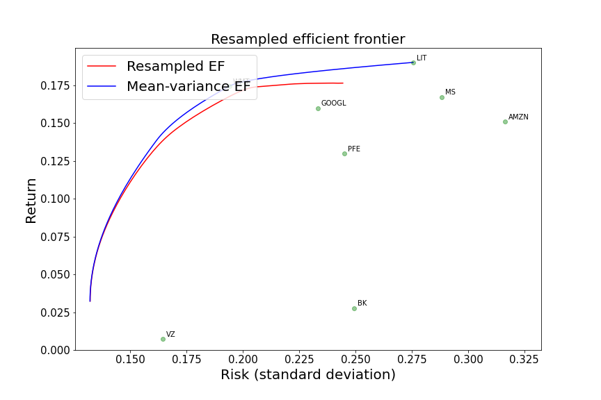
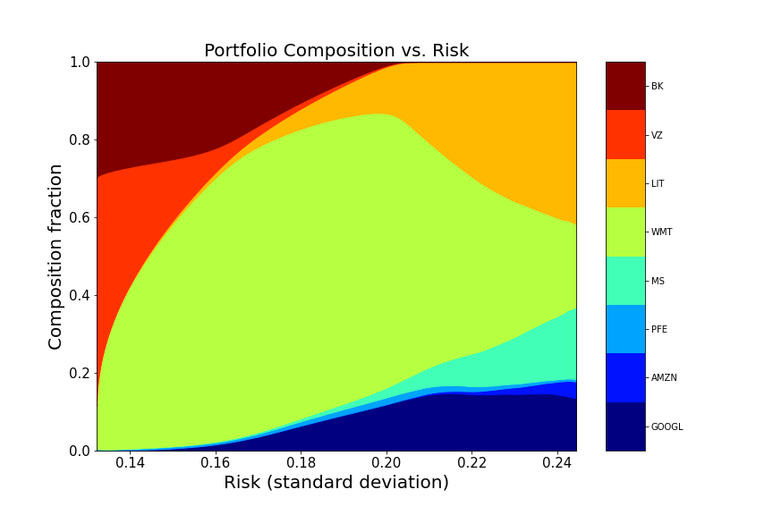

# efficient-frontiers
Module containing functions that grab stock data from Alpha Vantage
and use historical returns (or provided expected returns) to create
a Resampled Efficient Frontier for the asset portfolio. The idea
of resampled frontiers comes from Michaud & Michaud 2008 (https://www.newfrontieradvisors.com/media/1138/estimation-error-and-portfolio-optimization-12-05.pdf) and produces
smoother, more conservative portfolio transitions from one risk level
to another compared to classical mean-variance efficient frontiers from
Markowitz 1956. The portfolio optimization and resampling techniques in this
module do not consider portfolio rebalancing or any time-to-trade rules; the
portfolios are considered static and trading decisions are left to the user.
See the Wikipedia page for more information on portfolio optimization (https://en.wikipedia.org/wiki/Modern_portfolio_theory).
The figures below show examples of efficient frontiers (left panel) and
resampled portfolio composition as a function of risk (right panel).

  
   

Note that the frontier resampler and plot functions can be used without
querying Alpha Vantage. This module was written in part to get experience
pulling stock data from Alpha Vantage but any array of asset returns,
standard deviations, and correlations will work for the efficient 
frontier calculations. 

Functions
---------
get_stock_info

frontier_resampler

ref_plots
    
Package dependencies
--------------------
numpy

pandas

alpha_vantage.timeseries

cvxopt

matplotlib

